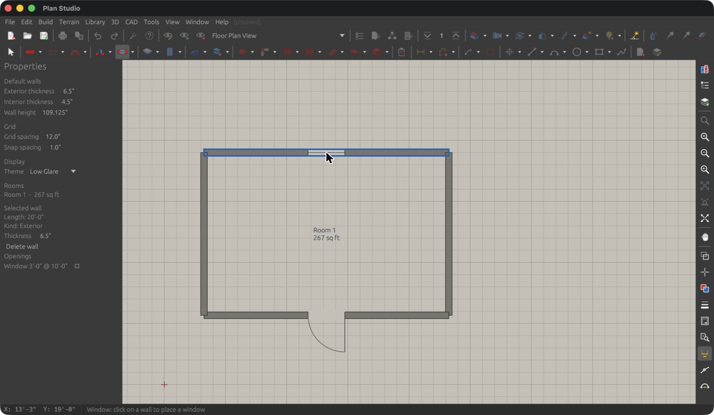

# Plan Studio

An open-source residential design CAD application written in Rust, in the
spirit of Chief Architect: you draw walls on a floor plan, and rooms, 3D,
elevations, schedules and construction documents are generated from that one
model.

**Status: pre-alpha, but a working editor.** Plan Studio opens, edits and saves
plans, draws in 2D and 3D, arranges plans on layout sheets, and writes schedules, DXF, glTF and PDF. The workspace
has 22 crates and 1,852 tests (through Round 8). See
[ROADMAP.md](ROADMAP.md) for what is done and what is left, [CHANGELOG.md](CHANGELOG.md) for what each round added, and the
[reference manual](docs/manual/00-index.md) for how everything works today. No version has been tagged yet; the
[release checklist](docs/release-checklist.md) says how a release is cut and what is still to be checked by hand.
[docs/chief-x18-ui-notes.md](docs/chief-x18-ui-notes.md) is the UI study the
design is based on.

## Screenshots



The window above shows the Chief-style toolbars, menus and the Low Glare theme. It was captured on 2026-10-07,
before Rounds 2 to 8 added the dialogs and docks, the 3D view, the Chief catalogs in the Library Browser, curved walls and the
other wall kinds, slabs, the roof and framing tools, the layout view, schedules in the plan, exterior details, cameras, the CAD, cabinet
and text completeness, stairs with railings, terrain and landscaping, and images, so the toolbars have far more working buttons now than it shows. It has not been retaken. Earlier milestone: [phase 0 screenshot](docs/screenshot-phase0.jpg).

## Why

Chief Architect is the reference tool for residential designers, but it is
closed, Windows/macOS only, and expensive. Plan Studio aims at the core
residential workflow, open source, with a modern Rust codebase that others can
extend.

## What it does today

- **Tools** (Chief's names and hotkeys): walls (straight and curved exterior, interior, foundation, pony, glass,
  glass pony and half walls, room dividers, railings, deck railings and edges, fencing; wall hatching and material
  regions); doors and windows; dimensions (manual, end to end, interior, point to point, running, baseline, centerline,
  angular, tape measure, automatic exterior, interior, elevation and story pole); text (text, rich text with markup, leader
  line, arrow line, callout, marker, note with note types, text macros); CAD (points, lines, polylines, arcs, circles,
  boxes, cross, blocking and insulation boxes, polygons, splines, revision clouds, CAD blocks, fillet, chamfer, offset,
  trim, extend, break, hatch, CAD detail from view); cabinets (base, wall, full height, soffit, shelf, partition, fillers,
  corner and blind cabinets, custom countertops, backsplashes and counter holes, Generate Countertop); library symbols;
  stairs (straight, L, U, winder, curved, Click Stairs, rectangle and polygon landings, ramps with landings, with a wall, railing or half wall on each side,
  open or closed risers, stringer styles and Auto Stairwell that cuts the floor above); slabs (slab, slab with footing, slab holes, square pad, round
  pier) and holes in floor and ceiling platforms; roofs (Build Roof, roof planes, ceiling planes, gable lines, Join Roof
  Planes, holes, skylights, Auto Dormer, Auto Floating Dormer and Explode Dormer, roof returns); exterior details (corner
  boards, quoins, moldings, floor material regions, polygon decks, 3D solids); electrical devices with Auto Place
  Outlets; terrain and landscaping (perimeter, elevation points, lines and splines, break lines, hills and valleys, features, straight and curved terrain walls and curbs,
  roads, driveways and sidewalks as polylines or splines, garden beds, grass, water features, stepping stones, plant and sprinkler runs, Build Terrain with contours); images (pictures,
  billboards, an image library and objects distributed along a path or over a region, and the 3D Solid Feature); framing (Build Framing for
  walls, floors and roofs, 19 manual framing tools, a lumber takeoff with a material list); cameras (full, section,
  wall elevation, auto elevations, walkthrough paths) and lights.
- **Select Objects** picks, moves, stretches and edits every object kind (placed framing, slabs and the exterior
  details and placed schedules included), with temporary dimensions, snaps, an Edit toolbar, copy and paste, and whole-plan
  undo and redo that names each step. Plan and layout edits share one undo stack.
- **Layout**: File > New Layout opens a layout view with page tabs, boxes you move and resize by handles, Send to Layout
  (plan views and elevation or section cameras), a Layout Box Specification, Page Setup, a page table, and Print Layout
  and Export Layout PDF. Schedules (door, window, room, cabinet, electrical, framing, plant, fixture, furniture and
  general) can also be placed in the plan as live tables with callout labels (you select, move and delete them like any other object), and Project
  Information fills the title block.
- **Dialogs**: Chief-style specification dialogs for walls (with a Wall Class list and Wall Type Definitions), doors, windows, rooms,
  floors and foundations, slabs, pads and piers, dimensions, text, CAD, cabinets, symbols, stairs and landings, pictures and distributions, roofs (with holes, per-edge
  roof settings, ceiling planes and dormers), framing members, exterior details, schedules, electrical devices, terrain and landscape objects, and cameras; Default Settings (walls, doors,
  windows, saved dimension defaults, room types, text styles, the Preferences > Templates page); Customize Hotkeys; Layer Display Options; the Space
  Planning Assistant; Plan Check and Door/Window Check; schedules, the Framing Takeoff and the Materials List.
- **Docks**: Active Layer Display Options (layer sets and saved plan views), Project Browser (floors, cameras, saved
  views, layout pages) and the Library Browser (about 145 built-in 2D symbols, plus your Chief Architect Core, Bonus,
  Manufacturer and User catalogs read in place from your install, with thumbnails, search and Open Object).
- **3D**: overview, floor overview, doll house, Full Camera, cross sections and the four elevations in an orbitable view;
  walls of every class, floors and ceilings at each room's own heights, slabs and piers, roofs with holes, skylights and dormers, cabinets, stairs with their
  railings and the stairwell opening, terrain with roads and landscaping, pictures, manual framing, exterior details, and placed
  symbols (Chief objects with their decoded meshes); nine rendering techniques, Sun Angle, a CPU path tracer with PNG output, and
  glTF export. Elevation and section cameras store hatch, shadow, line-weight and label options and open as vector drawings
  (Vector View, Technical Illustration); walkthroughs play and record as frame sequences; point lights feed the ray tracer.
- **Documents**: door, window, room and wall schedules, materials list, framing takeoff (CSV and material list),
  hidden-line elevations, construction set PDF (18 x 24 sheets, Daniel's title block with macros and a revisions table,
  automatic scale, layer colors and weights), DXF export of a floor (with roof planes and manual framing) or the four
  elevations, DXF import and CAD to Walls.
- **Plan files**: `.psplan` JSON with typed slots for roofs, electrical, framing, slabs, schedules and terrain, typed lists for CAD styles, CAD blocks, text macros and note types, and typed extras for
  walls, openings, rooms and cameras; files from before the slots open and convert on their own.
- **Chief data**: Daniel's Chief X18 template is built in; Plan Studio reads your own Chief default plan and layout templates
  (named in Chief's preferences) and seeds its defaults from them, with a Preferences > Templates page; File > Templates >
  Import Chief Template reads a Chief `.plan` for its layer sets, wall types (real layer stacks), text styles and dimension defaults; his customized hotkeys are loaded on top of
  Chief's, and you can edit them. `plan-calib` reads the `.calib` catalogs of your own Chief install, and the Library Browser
  shows them (never copying them).
- **Look**: four canvas themes (Low Glare is the default) and a UI brightness dimmer. View toggles for Color, Line Weights,
  Drawing Sheet, Print Preview and Reference Display change what the plan shows.
- **Samples**: three plans in [`samples/`](samples/README.md) (ranch, two-story
  colonial, studio ADU) open from File > Open Plan.

## Architecture

Twenty-two crates in one Cargo workspace (1,852 tests). Only `plan-app` and `plan-view3d`
touch the GUI; everything else is plain Rust, tested headlessly.

| Crate | What it is |
|---|---|
| `plan-core` | The model (project, floors, walls and wall classes, openings, rooms, slabs, layers, defaults, units), typed storage slots and extras, geometry, snapshot undo, ASCII DXF export |
| `plan-app` | The desktop editor (egui/eframe): tools, dialogs, docks, menus, hotkeys, themes |
| `plan-3d` | Plan to triangle meshes (every wall class, slabs, roofs with holes and dormers) and glTF 2.0 export (no GPU code) |
| `plan-view3d` | The egui/OpenGL 3D viewport widget and camera views |
| `plan-render` | CPU path tracer for the Physically Based and Clay techniques |
| `plan-roof` | Automatic roofs from a footprint (weighted straight skeleton), roof holes, skylights, ceiling planes, dormers, gable lines and returns |
| `plan-stairs` | Parametric stair engine: IRC checks, landings, curved stairs, ramps, railings and walls on each side, plan symbols and meshes |
| `plan-cabinets` | Parametric cabinet engine (face layouts, countertops, labels) |
| `plan-electrical` | Devices, plan symbols, Auto Place Outlets, connections, circuits |
| `plan-terrain` | Terrain perimeter, elevation data, modifiers, roads, contours, terrain walls and curbs, and the landscape objects (beds, grass, water, stones, plant and sprinkler runs) |
| `plan-framing` | Wall, floor and roof framing, manually placed members and trusses, layout lines, and the lumber takeoff |
| `plan-materials` | Material definitions, 2D hatches, textures, rendering technique presets, sun |
| `plan-library` | The catalog system behind the Library Browser |
| `plan-calib` | Read-only reader for Chief `.calib` / `.calibz` catalogs (the Library Browser's Chief nodes) |
| `plan-chiefplan` | Read-only scanner and decoder for Chief `.plan` / `.layout` templates |
| `plan-config` | Reads Chief's hotkeys, toolbars and preferences |
| `plan-docs` | Schedules, materials list and the scaled plan-sheet PDF |
| `plan-layout` | Headless layouts: pages, boxes, title blocks and macros, automatic scale, construction set PDF |
| `plan-elevation` | Hidden-line elevations, sections and plan overhead drawings, with hatch, poche, shadows and labels |
| `plan-import` | DXF reader, CAD objects from drawings, CAD to Walls |
| `plan-check` | Plan Check and Door/Window Check rule engine |
| `plan-spaceplan` | The Space Planning Assistant (room boxes to a first plan) |

Inside `plan-app`, every Chief tool is one module behind a shared `Tool` trait
(`tools/`), the services they share (selection, snapping, handles, temporary
dimensions, undo, rendering) live in `editor/`, the dialogs in `dialogs/`, and
the docks, hotkeys and 3D panel in `shell/`. `main.rs` owns the window and the
wiring. See [docs/architecture-tools.md](docs/architecture-tools.md) and
chapter 14 of the manual.

- **The plan is the model.** Every view is derived from `plan-core`.
- Lengths are stored in inches as `f64`; `plan_core::units` formats and parses
  architectural feet-and-inches (`12'-6 1/2"`).
- Room detection builds a planar graph from wall centerlines, splits at
  T-junctions and crossings, and traces the bounded faces.

## Building

Install Rust via [rustup](https://rustup.rs), then:

```bash
cargo test --workspace       # unit tests for every crate
cargo run -p plan-app        # launch the editor (binary: plan-studio)
```

Release builds and per-OS packages come from the Release workflow
(`.github/workflows/release.yml`, run by pushing a `vX.Y.Z` tag; see the
[release checklist](docs/release-checklist.md)); CI runs fmt, clippy and the tests on macOS,
Linux and Windows.

## Controls (plan-app)

| Action | Input |
|---|---|
| Tools | `Space` (or `1`) Select, `2` current wall, `3` Hinged Door, `4` Window; every other tool has its Chief hotkey (see the manual, chapter 13) |
| Draw walls | click start, click end, keep clicking to chain, or press-drag-release for one wall; `Esc` to stop |
| Select / move | click, `Tab` to cycle, drag a wall to move it perpendicular, drag handles to stretch, drag empty space to marquee |
| Undo / redo | `Cmd+Z`, `Shift+Cmd+Z` or `Cmd+Y` (`Ctrl` instead of `Cmd` on Windows and Linux, where `Ctrl+Z` is Undo and Daniel's Down One Floor key is not bound) |
| Angle snap | automatic at 15 degrees; hold `Alt` for free angle |
| Zoom / pan | scroll wheel or pinch / middle- or right-drag |
| Delete | select, press `Delete` |
| Hotkeys | Tools > Toolbars and Hotkeys > Customize Hotkeys |

## Documentation

- [Reference manual](docs/manual/00-index.md): 17 chapters from first launch to
  contributor notes, with an honest status mark on every feature.
- [CHANGELOG.md](CHANGELOG.md): what each round added, changed and fixed.
- [docs/release-checklist.md](docs/release-checklist.md): cutting a release, the licensing note and the manual QA pass still to be done.
- [docs/qa-findings.md](docs/qa-findings.md): the scenario tests' findings (seven, all fixed in Round 8).
- [docs/parity/](docs/parity/): the Chief behavior specifications the code cites
  (ids such as `W-21`), each with a "Plan Studio today" snapshot.
- [docs/chief-x18-*.md](docs/chief-x18-menus.md): captures of Chief's menus,
  toolbars, sub-tools and dialogs.
- [DECISIONS.md](DECISIONS.md): open questions for the project owner.

## Contributing

Issues and pull requests are welcome. Keep `plan-core` free of GUI code and
add a unit test with every geometry change. Run `cargo fmt`,
`cargo clippy --workspace --all-targets -- -D warnings` and
`cargo test --workspace` before opening a PR.

## License

MIT. See [LICENSE](LICENSE). No Chief Architect code, assets or catalog content
ships in this repository.
