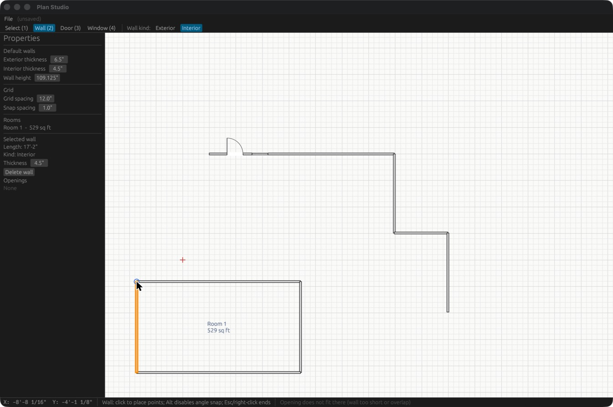

# Plan Studio

An open-source residential design CAD application written in Rust, in the
spirit of Chief Architect: you draw walls on a floor plan, and rooms, 3D,
elevations and schedules are generated from that one model.

**Status: pre-alpha.** The data model and 2D plan editor are the first
milestone. See [ROADMAP.md](ROADMAP.md) for where this is going and
[docs/chief-x18-ui-notes.md](docs/chief-x18-ui-notes.md) for the UI study the
design is based on.



## Why

Chief Architect is the reference tool for residential designers, but it is
closed, Windows/macOS only, and expensive. Plan Studio aims at the core
residential workflow, open source, with a modern Rust codebase that others can
extend.

## Architecture

```
crates/
  plan-core   pure data model + geometry (no GUI, fully unit-tested)
  plan-app    desktop editor built on egui/eframe
```

- **The plan is the model.** `plan-core` holds walls, openings, floors and
  (soon) cabinets, roofs and stairs. Every view is derived from it.
- Lengths are stored in inches as `f64`; `plan_core::units` formats and parses
  architectural feet-and-inches (`12'-6 1/2"`).
- Room detection builds a planar graph from wall centerlines, splits at
  T-junctions and crossings, and traces the bounded faces.

## Building

Install Rust via [rustup](https://rustup.rs), then:

```bash
cargo test -p plan-core      # unit tests for the model
cargo run -p plan-app        # launch the editor
```

## Controls (plan-app)

| Action | Input |
|---|---|
| Tools | `1` Select, `2` Wall, `3` Door, `4` Window |
| Draw walls | click start, click end, keep clicking to chain; `Esc` to stop |
| Angle snap | automatic at 15°; hold `Alt` for free angle |
| Zoom / pan | scroll wheel or pinch / middle- or right-drag |
| Delete | select a wall, press `Delete` |

## Contributing

Issues and pull requests are welcome. Keep `plan-core` free of GUI code and
add a unit test with every geometry change. Run `cargo fmt` and
`cargo clippy` before opening a PR.

## License

MIT. See [LICENSE](LICENSE).
